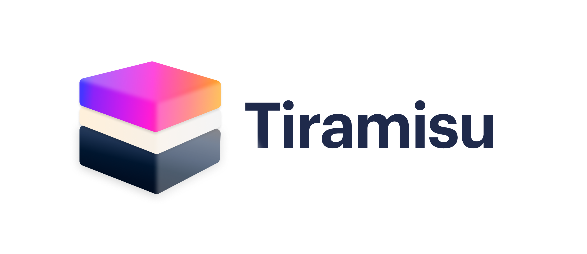

# Tiramisu
> Tiramisu is a "Layer Two" system for scalable token transfers that prioritizes simplicity.

[](https://github.com/dharma-eng/Tiramisu/blob/master/LICENSE.md) [](https://github.com/dharma-eng/Tiramisu/actions?query=workflow%3A%22Tiramisu%22) [](https://coveralls.io/github/dharma-eng/Tiramisu) [](https://discordapp.com/invite/qvKTDgR)

## Summary
**Tiramisu** is a framework for performing ERC20 token transfers at a fraction of the cost of a standard transfer.

It accomplishes this by aggregating transactions and committing them into blocks. However, it does not perform any on-chain computation for the transactions themselves. Instead, it simply includes a merkle root of the new account state along with the transaction data for each block. If some part of a block is invalid, anyone can submit a proof to that effect within a challenge period. Should they do so, they earn a reward and trigger a roll-back of the state.

Tiramisu is a member of the group of **"fraud proof rollup"** _(or "optimistic rollup")_ Layer Two technologies. That being said, Tiramisu **prioritizes simplicity** over raw scalability or generalizability — it designates a single block producer, and the only permitted operations are deposits, transfers, withdrawals, and authorization of additional signing keys.

These operations are broken down into two high-level categories:

- **Hard transactions**, including deposits and direct withdrawals or signing key additions, can only be initiated from a corresponding account on mainnet. These are placed in a queue as soon as the Tiramisu contract is called, and must be processed by the block producer in the order they are received.
- **Soft transactions**, including transfers and standard withdrawals or signing key modifications, require a signature from a designated signer, and the block producer can choose whether or not to include a given soft transaction in a block.

See the [specification](docs/README.md) for a more detailed overview of the design decisions behind Tiramisu.

⚠️ **Warning**: these contracts and libraries **have not been audited** and are **not yet production-ready!** ⚠️

## Table of Contents
- [Install](#install)
- [Usage](#usage)
- [Additional Information](#additional-information)

## Install
To install locally, you'll need [Node.js](https://nodejs.org/) 10 through 12 and [Yarn](https://yarnpkg.com/) _(or [npm](https://www.npmjs.com/))_. Then, perform the following:

```sh
$ git clone https://github.com/dharma-eng/Tiramisu.git
$ cd Tiramisu
$ yarn install
```

Once you've successfully pulled down the code and installed all dependencies, you'll need to compile both the application code (using TypeScript) as well as the contracts (using Truffle):

```sh
$ yarn build:ts   # compiles app/ and places output in dist/
$ yarn build:sol  # compiles contracts/ and places output in build/
```

## Usage
To run all the typescript tests in `test/tests/`:

```sh
$ yarn test:app
```

You can also run tests directly if you prefer for the blockchain class, the state wrapper class, or the state machine class that executes transactions:

```sh
$ yarn test:blockchain
$ yarn test:state
$ yarn test:transactions
```

To generate application test coverage using nyc:

```sh
$ yarn test:coverage:app
```

To generate contract test coverage using Truffle with the solidity-coverage plugin:

```sh
$ yarn test:coverage:sol
```

To run contract linters:

```sh
$ yarn lint
```

## Additional Information
This repository is maintained by [@0age](https://github.com/0age), [@d1ll0n](https://github.com/d1ll0n), and [@anna-carrol](https://github.com/anna-carroll).

Have any questions or feedback? Join the conversation in the [Dharma_HQ Discord server](https://discordapp.com/invite/qvKTDgR).
